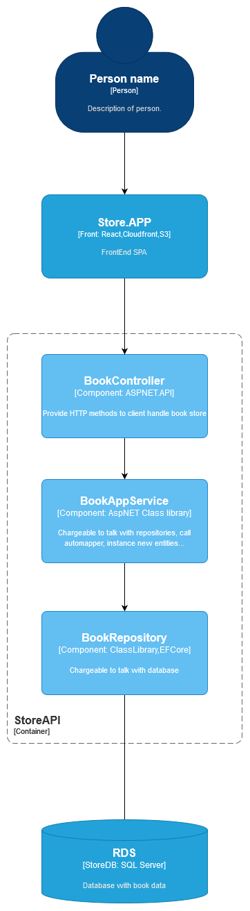

# Store Application


## Aula 4

Levantando banco de dados ```docker-compose up```

* Configurando ef globalmente em sua máquina para rodar o migration
```dotnet tool install --global dotnet-ef```

* Criando migration inicial: ```dotnet ef --startup-project .\Store.Web.Mvc\Store.Web.Mvc.csproj migrations add InitialMigration  --output-dir Migrations --project .\Store.Infra.Data\Store.Infra.Data.csproj --verbose```

* Criando atualizando banco de dados: ```dotnet ef --startup-project .\Store.Web.Mvc\Store.Web.Mvc.csproj database update```

- Obs.: Caso já exista um migration rode apenas o update
- Caso precise atualizar a estrutura do banco de dados, adicione/ atualize o migration

## Aula 5

- Utilizando o fluent validator
- Implementação de testes unitários na camada de Domínio
- Dominios ricos vs dominios anêmicos
- Implementando teste unitário na camada de service usando Bogus, AutoMock e Fixture

## Aula 6

- Criando modelo de resposta genérico
- Utilizando Notification pattern de forma a evitar lançar exceções no código
- Iniciar implementação da camada de API

## Aula 7

- Finalizando camada de API
- Implementando Swagger
- Utilizando Data Annotation


## Aula 8

### Fazendo um CRUD com a entidade book fazendo revisão em tudo que trabalhamos

- Camada de Domínio ```Store.Domain```
    - Criação da entidade 
        - Criação da classe ```Book``` fazendo herança da classe abstrata ```Entity<>```
        - Aplicação das validações na entidade respeitando o conceito de Domínios Ricos
        - Atributos com Set privado garantindo princípio open-closed

    - Criação de contrato do repositóio
        - Criação da interface ```IBookRepository``` herdando da interface abstrata IRepositoy<> 
    
    - Implementação de testes unitários da entidade na camada ```Store.DomainTests``` validando regras de negócio

- Camada de Data ```Store.Infra.Data```
    - Criação do repositório
        - 
        - Implementação da interface IBookRepository herdando de Repository<> que já contém alguns métodos de persistencia (```BookRepository```)

    - Configuração e criação da nova entidade no banco de dados
        - Criação da classe ```BookMapping``` com o mapping para criação de nova tabela
        - Referencia da classe de mapping criada no ```AppDbContext```
        - Rodamos comando ```dotnet ef --startup-project .\Store.API\Store.API.csproj migrations add BookMigration --output-dir Migrations --project .\Store.Infra.Data\Store.Infra.Data.csproj --verbose``` para criar uma nova migration para o banco de dados
        - Rodamos o comando ```dotnet ef --startup-project .\Store.API\Store.API.csproj database update``` para rodar scripts do migration no  e criar nova Entidade/Tabela no banco

- Camada de Application ```Store.Application```
    - Criação de DTOS (Data transfer object) para realizar leitura e escrita no banco de dados
    - Criação do contrato ```IBookAppService``` com os casos de uso para serem utilizados nas camadas de API, MVC
    - Implementação do contato acima contendo lógica para:
        - Realizar mappings
        - Instanciar novas entidades
        - Enviar novas entidades ao banco de dados
        - Fazer notificações

    - Testar classe ```BookAppService``` no projeto ```Store.ApplicationTests```
    - Criar automapper para converter domínio em DTO na classe ```ServiceProfile```

- Camada de injeção de dependencia e filters ```Store.CrossCutting```
    - Fazer injeção de dependencia entre ```IBookRepository``` e ```BookRepository```
    - Fazer injeção de dependencia entre ```IBookAppService``` e ```BookAppService```

- Camada de API ```Store.API```
    - Criação da classe ```BookController``` herdando de ```BaseController```
    - Comentários XML que irão auto contruir swagger


### Criação do Diagrama C4 representando o que construimos



### Debates
- OnPremise, Virtualização, Containerização e Serverless
- S3

## Links úteis

#### Documentações e referencias
- [AspnetCore 7](https://learn.microsoft.com/pt-br/aspnet/core/?view=aspnetcore-7.0)
- [Arquitetura de referencia de microsservicos em .NET](https://github.com/dotnet-architecture/eShopOnContainers)
- [Arquitetura serverless](https://blog.tecnospeed.com.br/o-que-e-arquitetura-serverless/)
- [Singleton vs transient vs scoped](https://balta.io/blog/addtransient-addscoped-addsingleton)
- [UML C4 Model](https://c4model.com/)
- [Entity Framework Core](https://learn.microsoft.com/pt-br/ef/core/)
- [Well Architected Framework](https://aws.amazon.com/architecture/well-architected/?wa-lens-whitepapers.sort-by=item.additionalFields.sortDate&wa-lens-whitepapers.sort-order=desc&wa-guidance-whitepapers.sort-by=item.additionalFields.sortDate&wa-guidance-whitepapers.sort-order=desc)


#### Evangelizadores de .NET
- [Andre Baltieri](https://balta.io/)
- [Marcoratti](https://www.macoratti.net/)
- [Eduardo Pires](https://desenvolvedor.io/blog)
- [Renato Groffe](https://renatogroffe.medium.com/)

#### Outros

- [DrawIo](draw.io)
- [Dapper vs EF vs ADO](https://exceptionnotfound.net/- dapper-vs-entity-framework-vs-ado-net-performance-benchmarking/)
- [Amazon S3](https://aws.amazon.com/pt/s3/pricing/?trk=c7f743d7-9b85-4db0-b6f1-d2387daa5845&sc_channel=ps&ef_id=EAIaIQobChMIsNv5v-v3-wIVpEVIAB0rjg3XEAAYASABEgIwnPD_BwE:G:s&s_kwcid=AL!4422!3!626321541794!p!!g!!s3)
- [Lambda Functions](https://aws.amazon.com/pt/lambda/)
- [AWS Toolkit for visual studio](https://marketplace.visualstudio.com/items?itemName=AmazonWebServices.AWSToolkitforVisualStudio2022)
- [Comparacao de servicos Azure vs AWS vs GCP](https://labs.sogeti.com/aws-vs-azure-vs-google-cloud-comparison/)
